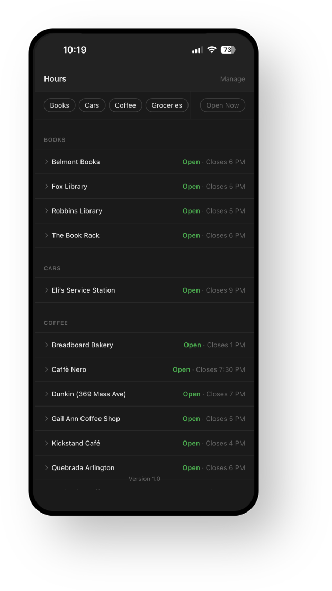
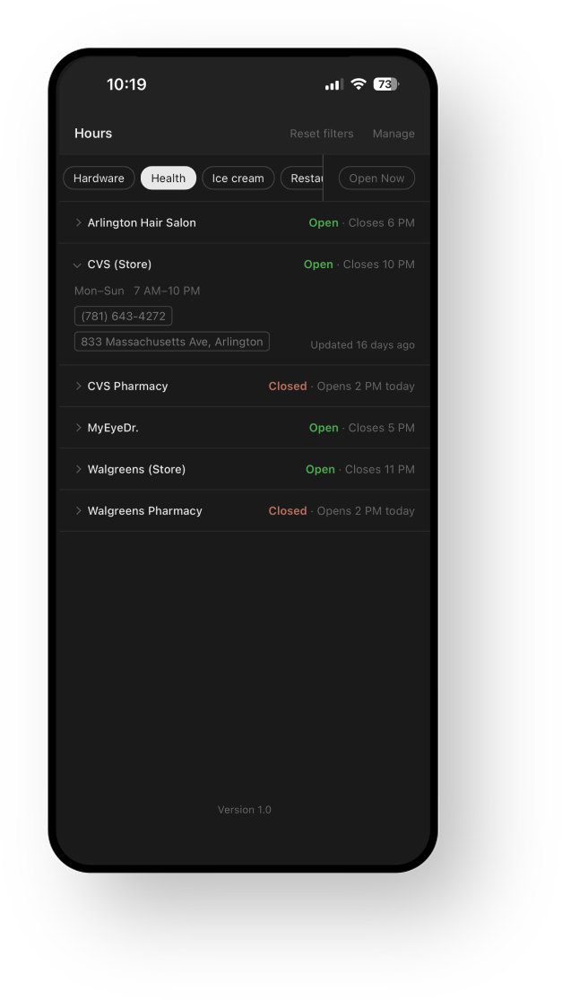
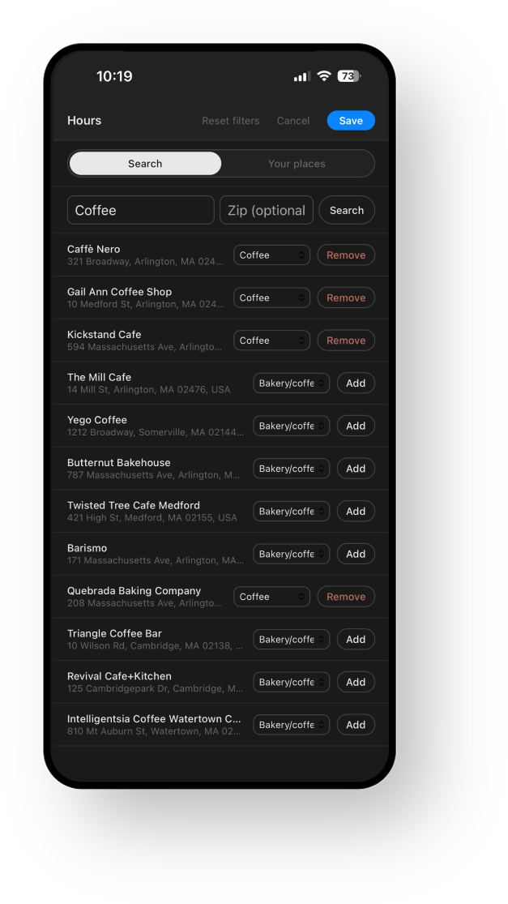

# Hours — Local Business Hours PWA

A lightweight PWA that displays open hours for your own list of local businesses, built entirely by searching and adding them yourself from the app. Designed to be faster than checking Google Maps, Yelp, or Apple Maps for the one thing you actually need: "are they open right now, and when do they close?"

Installable on iPhone via Safari → Share → Add to Home Screen.

## Screenshots

| Business list                                                                                        | Filters                                                                                                     | Edit mode search                                                                         |
| ---------------------------------------------------------------------------------------------------- | ----------------------------------------------------------------------------------------------------------- | ---------------------------------------------------------------------------------------- |
|  |  |  |

## Why this exists

Looking up hours for a local business takes 15–30 seconds in a maps app: launch, search, scroll past photos and reviews, find the hours section. This app shows you hours for every business you care about in under 1 second with a single glance.

## Architecture

```
┌─────────────────────────────────────────────┐
│  1. Static hosting (rsync to web server)     │
│     - index.html / app.js / sw.js            │
│     - manifest.json                          │
├─────────────────────────────────────────────┤
│  2. Edit-mode API proxy (persistent Node     │
│     process, scripts/api-server.js)          │
│     - Keeps the Google API key server-side   │
│     - Stateless: searches Places by zip,     │
│       query, and/or device location, and     │
│       fetches hours for placeIds — nothing   │
│       is stored server-side                  │
├─────────────────────────────────────────────┤
│  3. PWA frontend (vanilla JS)               │
│     - Reads from localStorage on load        │
│     - Own personal business list, per        │
│       device — see "Personal list" below     │
│     - Service worker for offline support     │
└─────────────────────────────────────────────┘
```

### Personal list & Edit mode

Each installed device owns its own business list in localStorage — there's no shared or default list. A brand-new install starts empty; the only way to add a business, ever, is Edit mode.

Tapping **Edit** opens a search panel and (if you grant location access) immediately shows businesses near you, no typing required. Google's place type is used to suggest a category for each result, which you can override before adding. You can also type a zip code and/or a text query to search elsewhere, and remove existing businesses from the same panel.

Ongoing freshness is a silent background check: if `hours_updated` is more than 7 days old, the app POSTs its tracked `placeId`s to the API proxy's `/api/details` and merges the results — no visible refresh button, no push notifications. This only touches `hours`/`phone`/`address`/`lat`/`lng`; `name`/`category` are never overwritten by a refresh.

Since Edit mode calls a live backend, it needs `scripts/api-server.js` running (see Setup below) — ordinary browsing never does.

**Note:** the API proxy is guarded by a shared-secret header embedded in `app.js`. Since `app.js` ships unminified to the browser, this is only a deterrent against casual/scripted abuse of your Google API key — not real authentication.

### Budget

Cost scales with usage, not with a fixed list — every device's search, add, and weekly background refresh hits the Enterprise SKU of Places API (New) independently. At personal/small-group scale this is likely near-free, but there's no fixed upper bound on call volume the way a single curated list would have. Worth keeping an eye on actual usage in the Google Cloud Console once Edit mode is live in the wild.

## Data model

Each business — held in localStorage and returned by the API proxy — has this shape:

```json
{
  "id": "robbins-library",
  "name": "Robbins Library",
  "category": "books",
  "placeId": "ChIJExample123",
  "phone": "(781) 555-0100",
  "address": "700 Massachusetts Ave, Arlington, MA",
  "lat": 42.4154,
  "lng": -71.1565,
  "hours": {
    "regular": {
      "mon": { "open": "09:00", "close": "21:00" },
      "tue": { "open": "09:00", "close": "21:00" },
      "wed": { "open": "09:00", "close": "21:00" },
      "thu": { "open": "09:00", "close": "21:00" },
      "fri": { "open": "09:00", "close": "17:00" },
      "sat": { "open": "10:00", "close": "17:00" },
      "sun": null
    },
    "overrides": [{ "date": "2026-05-25", "hours": null }]
  },
  "lastUpdated": "2026-05-05T06:00:00Z"
}
```

Field details:

- `id`: URL-safe slug, generated by slugifying the name when a business is added via Edit mode.
- `name`: Display name, from Google's `displayName` field.
- `category`: A freeform string, not a fixed enum — the filter bar derives its pills from whatever categories are present in the data. Defaults to a suggestion mapped from Google's `primaryType` (see `scripts/lib/category-map.js`), editable before adding.
- `placeId`: Google Place ID. Used by the API proxy to fetch/refresh hours.
- `hours.regular`: Keyed by 3-letter lowercase day abbreviation. Value is `{ open, close }` in 24h `"HH:MM"` format, or `null` for closed.
- `hours.overrides`: Array of date-specific exceptions from `currentOpeningHours` special days. `hours` is either `{ open, close }` or `null` (closed).
- `lastUpdated`: ISO 8601 timestamp of the last successful hours fetch for this business.

### localStorage keys (per device)

- `hours_data`: the device's full personal business list (array of the shape above).
- `hours_tracked_ids`: array of `placeId`s the device tracks — the source of truth for what the background refresh and Edit-mode removal operate on.
- `hours_updated`: ISO timestamp of the last successful refresh, shown at the bottom of the list and used to decide when the next background refresh is due.

## Frontend behavior

### First load (no personal list yet on this device)

Renders immediately with a "No businesses yet. Tap Edit to search for and add some." message. No network call is made.

### Subsequent loads

1. Read `hours_data` from localStorage and render immediately (target: <100ms to first paint of business list).
2. In the background, if `hours_updated` is more than 7 days old, POST `hours_tracked_ids` to the API proxy's `/api/details`, merge the returned hours/phone/address into the existing list (never touching `name`/`category`), update localStorage, and re-render. Silent — no visible loading or error state.

### Display logic

Each row shows two lines:

```
Robbins Library
Open · Closes 9 PM          ← or "Closed · Opens 9 AM tomorrow"
```

The status line is computed client-side from the hours data + the device's current time.

**Tap a row** to expand it in place, revealing the full weekly schedule (consecutive identical days grouped, e.g. "Mon–Fri"), any upcoming date-specific overrides, and phone/maps links if available.

### Filters

Filter pills are generated dynamically from whatever categories exist in the current business list (not a fixed set — starts empty and grows as you add businesses via Edit mode), plus a **Clear** button that only appears once a filter is active. Filters are single-select: tapping a pill activates it and deactivates whatever was previously active; tapping the active pill again clears it. Active filter state is purely in-memory; not persisted.

### Sort

When no filter is active, businesses are grouped by category (alphabetical) with businesses sorted by name within each group. When a filter is active, results are a flat list sorted by name.

## Project structure

```
/
├── app/                    # Frontend (deployed as static site)
│   ├── index.html          # Single page app shell
│   ├── app.js               # All frontend logic
│   ├── style.css           # Styles
│   ├── sw.js               # Service worker
│   ├── manifest.json       # PWA manifest
│   └── icon-*.png          # PWA icons
├── scripts/
│   ├── lib/
│   │   ├── hours-parser.js # Shared Google Places hours parsing
│   │   └── category-map.js # Google primaryType → app category suggestion
│   ├── api-server.js       # Persistent Edit-mode proxy: search + batch hours lookup
│   ├── deploy.sh           # Bumps SW cache version and rsyncs app/ to server (static frontend)
│   ├── deploy-api.sh       # Rsyncs api-server.js + lib/ to the droplet and restarts the service
│   └── start.js            # Local static server for previewing app/, proxies /api/* to api-server.js
├── .env                    # API keys, deploy paths, Edit-mode proxy config (not committed)
├── CLAUDE.md
└── README.md
```

## Setup

### Prerequisites

- Node.js 18+
- A Google Cloud project with Places API (New) enabled
- A Google API key with Places API access

### Configuration

1. Create a `.env` file in the project root:

```
DEPLOY_PATH=user@server:/var/www/example.com/html

# Edit-mode API proxy (scripts/api-server.js)
GOOGLE_PLACES_API_KEY=your_key_here
API_PORT=8787
APP_SHARED_SECRET=some-random-string
ALLOWED_ORIGIN=http://localhost:3000
# Nested alongside the site's own directory (sibling to html/) rather than
# its own /var/www entry — it's a proxied service, not a document root.
API_DEPLOY_PATH=user@server:/var/www/example.com/api-server
```

`APP_SHARED_SECRET` must also be set as the `APP_SHARED_SECRET` constant near the top of `app/app.js` — the two must match exactly (see the Edit-mode note above on why this is a deterrent, not real auth).

2. Serve the `app/` directory. To exercise Edit mode locally, run both the static server and the API proxy side by side (`start.js` proxies `/api/*` to `api-server.js`, so there's no CORS to deal with):

```bash
npm run api    # → http://localhost:8787 (Edit-mode API proxy)
npm run start  # → http://localhost:3000 (app; /api/* forwarded to the proxy above)
```

If you only need to browse the app (no Edit mode), `npm run start` alone is enough — the app will just show the empty state.

3. Open in Safari on iPhone → Share → Add to Home Screen, tap Edit, and start adding businesses.

## Day-to-day workflow

### Adding or removing a business

Use **Edit mode** in the app — search by location/zip/text, add, or remove. No script, no deploy. This only affects that device's personal list.

### Deploying frontend changes

After editing `app/` files (HTML, CSS, JS):

```bash
npm run deploy
```

The deploy rsyncs `app/` to `DEPLOY_PATH` with `--delete`, so removed files are cleaned up on the server, and bumps the service worker cache version so installed PWAs pick up the change.

### Deploying the API proxy

After editing `scripts/api-server.js` or `scripts/lib/`:

```bash
npm run deploy:api
```

Rsyncs the proxy code to `API_DEPLOY_PATH` and restarts the `hours-api` PM2 process on the server (the droplet already manages other Node services with PM2 — this follows the same convention rather than introducing a separate systemd unit). This is separate from `npm run deploy` on purpose — a frontend-only deploy should never need to restart the live proxy, and vice versa. First-time server setup (`pm2 start` under the app's directory, adding the nginx `/api/` proxy block) is a manual one-time step, not scripted here.
